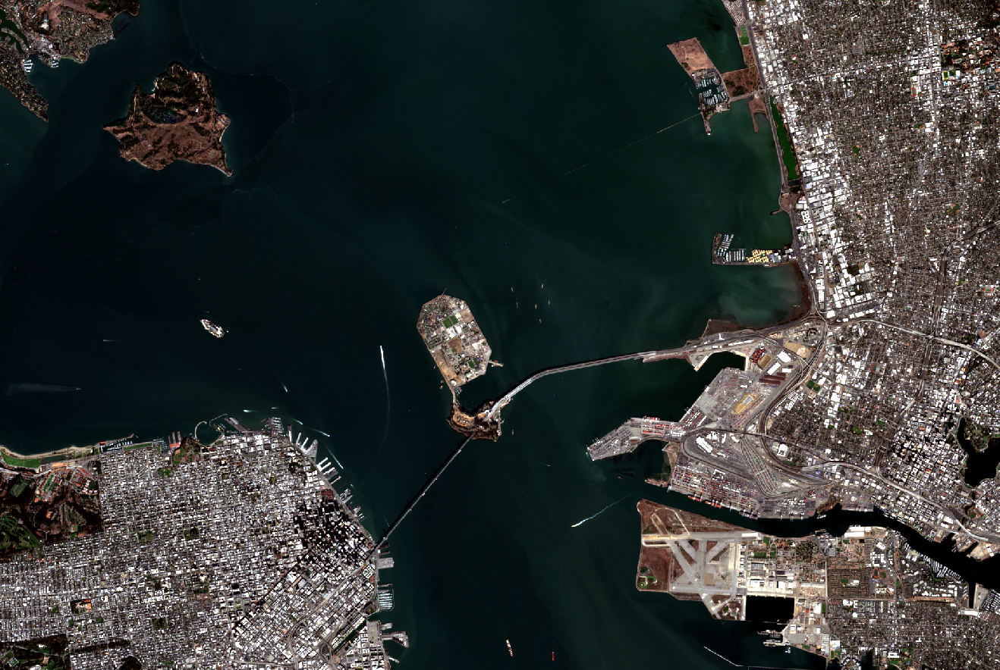

# satellite image processing and classification tool

## Process

1. Start by marking the area using google map or any equivalent and saving it to kml
2. Create project and download data using sentinelApi key 
3. Create different images using rasterData class
4. Crop images
5. Display the tiff Images
6. Apply Classification algorithm to any of the images preferably, allband image
7. Display classification image

### Uncropped Image

### Cropped Image

### Kmeans Classification using k=4
