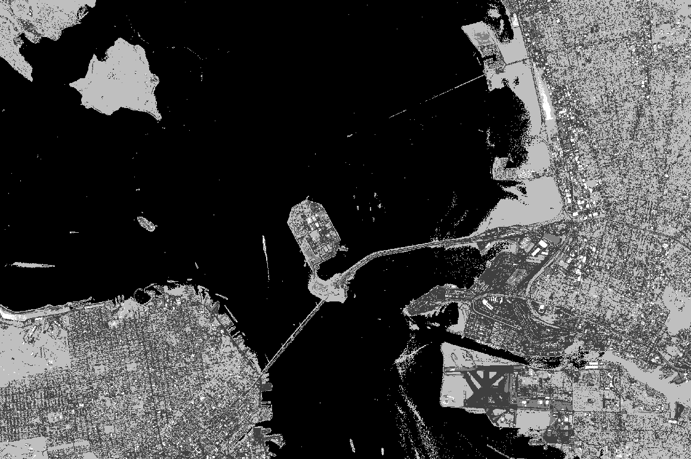

# Satellite Image Processing and Classification Tool
Project that uses Sentinel-2 satellite to download and classify spatial imagery
 

## Project Structure
├── assets  
├── env  
│   └── environment.yml  
├── kmlFiles  
│   ├── montreal.kml  
│   ├── sanfrancisco.kml  
├── projects  
│   ├── montreal  
│       ├── classfication  
│       ├── data  
│       │   └── 2019_09_18  
│       ├── images  
│       │   └── cropped  
│       └── montreal.kml  
├── README.md  
├── ressources  
│   ├── apiKeyTemplate.txt  
│   └── apiKey.txt  
└── src  
    ├── apiSession.py  
    ├── classification.py  
    ├── display.py  
    ├── geometryObject.py  
    ├── kmlHandler.py  
    ├── main.py  
    ├── projectManager.py  
    └── rasterData.py  
 

___
## Process

1. Start by marking the area using google map or any equivalent and saving it to kml
2. Create project and download data using sentinelApi key 
3. Create different images using rasterData class
4. Crop images
5. Display the tiff Images
6. Apply Classification algorithm to any of the images preferably, allband image
7. Display classification image

 

___
## Required Packages  
* Python 3.7+
* Numpy
* Matplotlib
* rasterio 
* osgeo
* sklearn
* gdal
* fiona
* sentinelsat

More detailed specification ca be found in env/environment.yml

 

____
## Examples

 

### Uncropped Image

### Cropped Image

### Kmeans Classification using k=4
